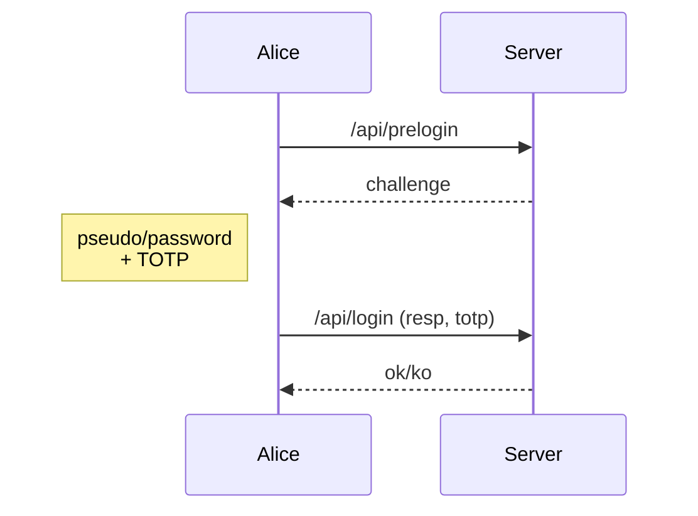
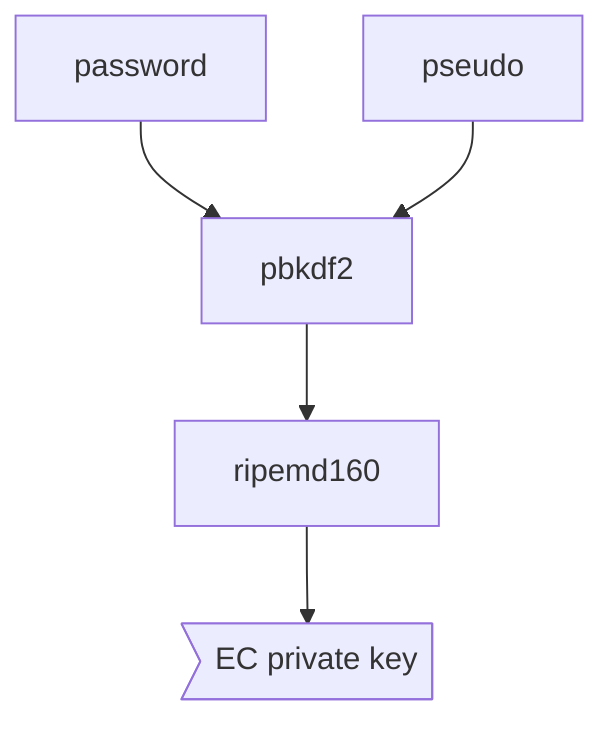

 

# Blutch Cerberus

Hi! Cerberus is a *(yet again)* new login authentication mechanism.

## History

Looking for a safe and simple login page for my own (family) webpages, my requirements were to not store clear (or recoverable) passwords in the server database (and nowhere else by the way), and to have a challenge/response. This looked basic security to me, but as I couldn't find anything satisfying (!), I started to create my own.
I share it here so it can help to have a better Internet!

## Concept

An attacker can use 3 points to steal a user password :

 - From the user browser (with a keylogger for exemple)
 - inspecting the clear traffic (Mitm, or deciphered by any way)
 - Having the content of the database (from a backup for exemple)

[Blutch Cerberus](https://github.com/peio42/cerberus) tries be *safe*, even if any of these 3 points had been compromised.
By *safe*, we mean the attacker still doesn't have enough information to recover user's credentials.

Cerberus proposes to use a fixed-size hash from the password as private key for the challenge/response mechanism. This way, only the public key is known by the server. Also, to avoid compromise from the browser itself, we complete it with a TOTP (for which the shared key has to be recoverable from the server database).

To avoid confusion, in the rest of this document and inside the code, we'll write:

 - **pseudo**: the (unique) user's login name
 - **login**: the action

For that, we follow a classical challenge/response mechanism:

To be able to generate a private key from any password, we'll use Ellitpic Curves Cryptography, more exactly for this implementation "secp256k1", as in its field, any number less than 255-bits long can be used as private key.
So first, we get a 160-bits long hash from login and password, using pbkdf2, then hashing the result with ripemd160:

It is important to associate password to a unique element (here the user's pseudo) before hashing it, so that two users using the same password isn not noticeable, or to avoid an attacker to prepare a dictionary.
In a way, we use the pseudo as salt for the password's hash.

# Architecture

The Cerberus algorithm can be used for any protocol and language. Its implementation here is written in Javascript for NodeJS, backed with a MongoDB database, and can be used right away through Nginx "auth_request" method.
As long as the protected pages belong to the same domain (or subdomains), it can be used without big modifications.

When a user wants to login, the pages use the mechanism described above, using the information stored in the base (mainly for pseudo, public key and totp secret). When the user is authenticated, a new session is created, and a cookie is associated to the session. Then for each http request, nginx will check the session exists. If needed, the user's pseudo or email can be forwarded to the application (for SSO, page personalization or application rights management).

There are also some specific pages to create a new user, or refresh his credentials in case they're forgotten (link would be sent by email).

# ToDo & Improvements

For a real use, it should be important to ensure the session hasn't been stoled. You could check it's only used from the original IP address, or that only one computer is using it at a time.

Don't be able to login twice with the same TOTP

Check password strength in javascript page

